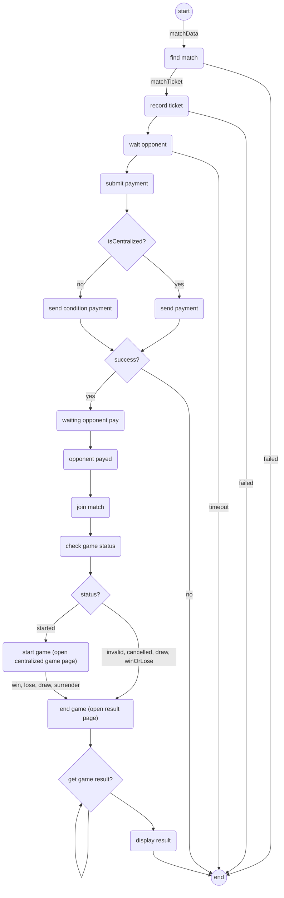

```mermaid
graph TD
    A((start)) -->|matchData| B(find match)
    B -->|matchTicket| C(record ticket)
    B -->|failed| End
    C --> D(wait opponent)
    C --> |failed| End
    D --> E(submit payment)
    D --> |timeout| End
    E --> F{isCentralized?}
    F -->|yes| G(send payment)
    F -->|no| H(send condition payment)
    G --> I{success?}
    H --> I
    I -->|yes| J(waiting opponent pay)
    I -->|no| End((end))
    J --> K(opponent payed)
    K --> L(join match)
    L --> M(check game status)
    M --> N{status?}
    N -->|started| O("start game (open centralized game page)")
    N -->|invalid, cancelled, draw, winOrLose| P("end game (open result page)")
    P --> Q{get game result?}
    Q --> Q
    O -->|win, lose, draw, surrender| P
    Q --> R(display result)
    R --> End
```
<!--stackedit_data:
eyJoaXN0b3J5IjpbMzIyMTkyNDg3LC0yMDg4NzQ2NjEyLC0xNj
AyNDQxMDMsOTM3Mjg5NywtMTM2NzgzMjMxNSw3NzczMjU2MzEs
NjM3MDI2OTY3LDE4MzU0MTYyMzMsLTg3MTYxOTAzNl19
-->