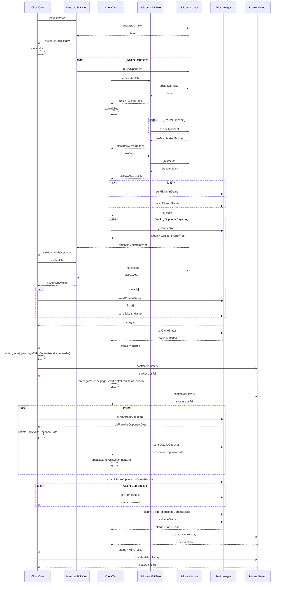

```mermaid
sequenceDiagram
    participant A as ClientOne
    participant B as NakamaSDKOne
    participant C as ClientTwo
    participant D as NakamaSDKTwo
    participant E as NakamaServer
    participant F as FeeManager
    participant G as BackupServer

    
    A ->> B: requestMatch
    B ->> E: addMatchmaker
    E -->> B: ticket
    B -->> A: matchTicketIsReady
    A -> A: save ticket
    loop WaitingOpponent
        B ->> E: queryOpponent
    end
    C ->> D: requestMatch
    D ->> E: addMatchmaker
    E -->> D: ticket
    D -->> C: matchTicketIsReady
    C ->> C: save ticket
    loop SearchOpponent
        D ->> E: queryOpponent
    end
    E -->> D: onMatchMakerMatched
    D -->> C: didMatchWithOpponent
    C ->> D: joinMatch
    D ->> E: joinMatch
    E -->> D: didJoinMatch
    D -->> C: didJoinNewMatch
    alt is ETH
        C ->> F: sendEtherInGame
    else
        C ->> F: sendTokenInGame
    end
    F -->> C: success
    loop WaitingOpponentPayment
        C ->> F: getGameStatus
        F -->> C: status = waitingForEntryFee
    end
    E -->> B: onMatchMakerMatched
    B -->> A: didMatchWithOpponent
    A ->> B: joinMatch
    B ->> E: joinMatch
    E -->> B: didJoinMatch
    B -->> A: didJoinNewMatch
    alt is eth
        A ->> F: sendEtherInGame
    else is gt
        A ->> F: sendTokenInGame
    end
    F -->> A: success
    C ->> F: getGameStatus
    F -->> C: status = started
    F -->> A: status = started
    A ->> A: enter game(open pageCelerCentralizedGameLoader)
    A ->> G: postMatchHistory
    G ->> A: success or fail
    C ->> C: enter game(open pageCelerCentralizedGameLoader)
    C ->> G: postMatchHistory
    G ->> C: success or fail
    loop Playing
        A ->> F: sendDataToOpponent
        F -->> A: didReceiveOpponentData
        A ->> A: updateGameWithOpponentData
        C ->> F: sendDataToOpponent
        F -->> C: didReceiveOpponentData
        C ->> C: updateGameWithOpponnetData
    end
    A ->> F: submitScore(open pageGameResult)
    loop WaitingGameResult
        A ->> F: getGameStatus
        F -->> A: status = started
    end
    C ->> F: submitScore(open pageGameResult)
    C ->> F: getGameStatus
    F -->> C: status = winOrLose
    C ->> G: updateMatchHistory
    G -->> C: success of fail
    F -->> A: status = winOrLose
    A ->> G: updateMatchHistory
    G -->> A: success or fail


```
